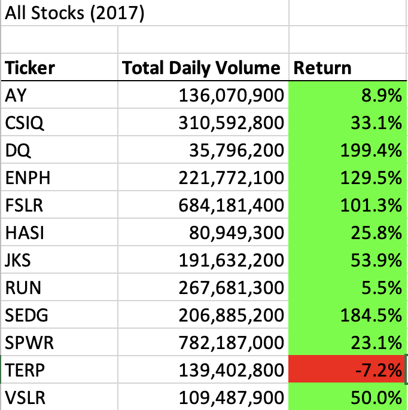
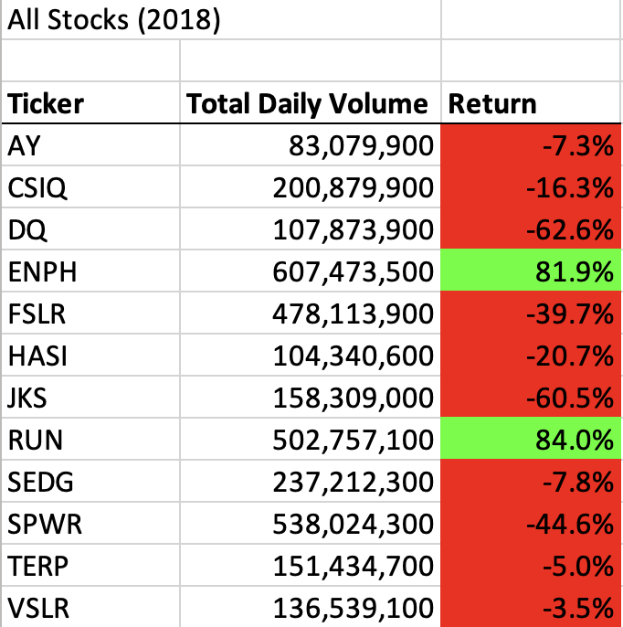
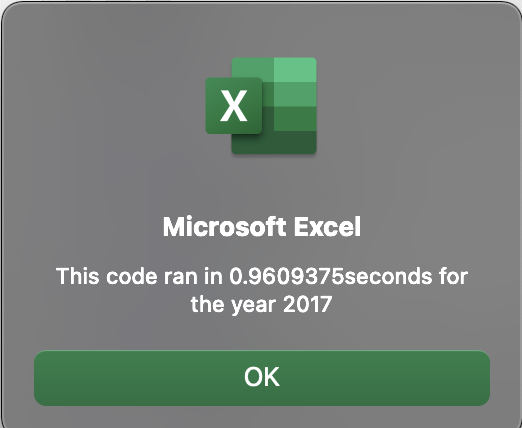
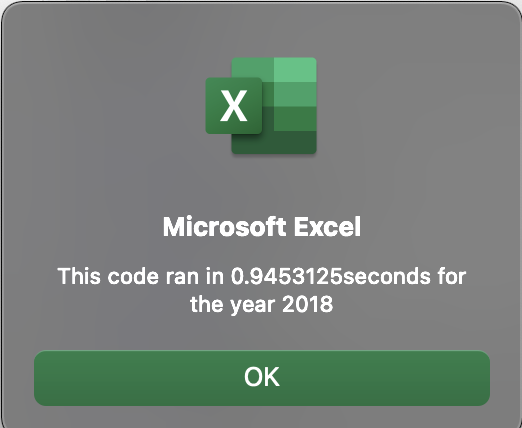
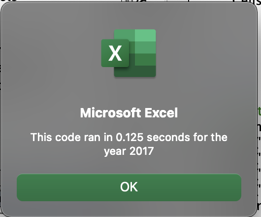
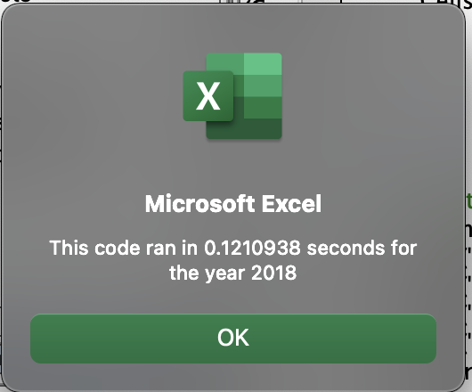

# Stocks Analysis with VBA 
## Overview of Project

### Purpose

The purpose of this project is to help Steve analyze green energy stocks in order to help his parents decide whether or not invest their money into DAQO new energy corporation, which is a company that makes silicon wafers for solar panels. In this project, I used Excel VBA to analyze the green energy stock data with 12 stocks to determine the yearly return for 2017 and 2018 of each stock. Also, I refactored the original code in order to improve the code performance in time efficiency.

## Results

### Example of code

The below image is an example of my code before refactoring:

```ruby
Sub AllStocksAnalysis()
    '1) format the output sheet on the "All stock analysis" worksheet
    Worksheets("All Stocks Analysis").Activate
    Dim startTime As Single
    Dim endTime As Single
    
    yearValue = InputBox("What year would you like to run the analysis on?")
    

    startTime = Timer
    
    Range("A1").Value = "All Stocks(" + yearValue + ")"
    'Create a header row
    Cells(3, 1).Value = "Ticker"
    Cells(3, 2).Value = "Total Daily Volume"
    Cells(3, 3).Value = "Return"
    
    '2) Initialize an array of all tickers
    Dim tickers(12) As String
    tickers(0) = "AY"
    tickers(1) = "CSIQ"
    tickers(2) = "DQ"
    tickers(3) = "ENPH"
    tickers(4) = "FSLR"
    tickers(5) = "HASI"
    tickers(6) = "JKS"
    tickers(7) = "RUN"
    tickers(8) = "SEDG"
    tickers(9) = "SPWR"
    tickers(10) = "TERP"
    tickers(11) = "VSLR"
    
    '3a) Initialize variables for starting price andending price
    Dim startinPrice As Double
    Dim endingPrice As Double

    '3b) Activate dataworksheet
    Worksheets(yearValue).Activate
    '3c) Get the number of rows to loop over
    RowCount = Cells(Rows.Count, "A").End(xlUp).Row
    '4)loop through tickers
    For i = 0 To 11
        ticker = tickers(i)
        'Everytime we finish analysis on one ticker, we need to reset the total volume to zero
        totalVolume = 0
        
        '5) loop through rows in the data
        Worksheets(yearValue).Activate
        For j = 2 To RowCount
            '5a) get total volume for current tickers
             If Cells(j, 1).Value = ticker Then
                totalVolume = totalVolume + Cells(j, 8).Value
            End If
            '5b)get starting price for current ticker
             If Cells(j - 1, 1).Value <> ticker And Cells(j, 1).Value = ticker Then
            startingPrice = Cells(j, 6).Value
            
            End If
           '5c) get ending price for current ticker
        
            If Cells(j + 1, 1).Value <> ticker And Cells(j, 1).Value = ticker Then
                endingPrice = Cells(j, 6).Value
            End If
            
        Next j
        
        '6) output data for current ticker
        Worksheets("All Stocks Analysis").Activate
        Cells(4 + i, 1).Value = ticker
        Cells(4 + i, 2).Value = totalVolume
        Cells(4 + i, 3).Value = endingPrice / startingPrice - 1
        
    Next i
    endTime = Timer
    MsgBox "This code ran in " & (endTime - startTime) & "seconds for the year " & (yearValue)
End Sub

Sub formatAllStocksAnalysisTable()
    'Formatting
    Worksheets("All Stocks Analysis").Activate
    Range("A3:C3").Font.Bold = True
    Range("A3:C3").Borders(xlEdgeBottom).LineStyle = xlContinuous
    Range("B4:B15").NumberFormat = "#,##0"
    Range("C4:C15").NumberFormat = "0.0%"
    Columns("B").AutoFit
    dataRowStart = 4
    dataRowEnd = 15
    For i = dataRowStart To dataRowEnd
        If Cells(i, 3) > 0 Then
            Cells(i, 3).Interior.Color = vbGreen
        ElseIf Cells(i, 3) < 0 Then
            Cells(i, 3).Interior.Color = vbRed
        Else
            Cells(i, 3).Interior.Color = xlNone
        
        End If
    
    Next i

End Sub

```

The below image is an example of my code after refactoring:

```ruby
Sub AllStocksAnalysisRefactored()
    Dim startTime As Single
    Dim endTime  As Single

    yearValue = InputBox("What year would you like to run the analysis on?")

    startTime = Timer
    
    'Format the output sheet on All Stocks Analysis worksheet
    Worksheets("All Stocks Analysis").Activate
    
    Range("A1").Value = "All Stocks (" + yearValue + ")"
    
    'Create a header row
    Cells(3, 1).Value = "Ticker"
    Cells(3, 2).Value = "Total Daily Volume"
    Cells(3, 3).Value = "Return"

    'Initialize array of all tickers
    Dim tickers(12) As String
    
    tickers(0) = "AY"
    tickers(1) = "CSIQ"
    tickers(2) = "DQ"
    tickers(3) = "ENPH"
    tickers(4) = "FSLR"
    tickers(5) = "HASI"
    tickers(6) = "JKS"
    tickers(7) = "RUN"
    tickers(8) = "SEDG"
    tickers(9) = "SPWR"
    tickers(10) = "TERP"
    tickers(11) = "VSLR"
    
    'Activate data worksheet
    Worksheets(yearValue).Activate
    
    'Get the number of rows to loop over
    RowCount = Cells(Rows.Count, "A").End(xlUp).Row
    
    '1a) Create a ticker Index, from 0 to 11
    tickerIndex = 0
    

    '1b) Create three output arrays
    Dim tickerVolumes(12) As Long
    Dim tickerStartingPrices(12) As Single
    Dim tickerEndingPrices(12) As Single
    
    
    
    ''2a) Create a for loop to initialize the tickerVolumes to zero.
    For j = 0 To 11
        tickerVolumes(j) = 0
        
    Next j
        
    ''2b) Loop over all the rows in the spreadsheet.
    For i = 2 To RowCount
    
        '3a) Increase volume for current ticker
        tickerVolumes(tickerIndex) = tickerVolumes(tickerIndex) + Cells(i, 8).Value
        
        
        '3b) Check if the current row is the first row with the selected tickerIndex.
        'If  Then
        If Cells(i, 1).Value = tickers(tickerIndex) And Cells(i - 1, 1).Value <> tickers(tickerIndex) Then
            tickerStartingPrices(tickerIndex) = Cells(i, 6).Value
            
        'End If
        End If
        
        
        '3c) check if the current row is the last row with the selected ticker
         'If the next row’s ticker doesn’t match, increase the tickerIndex.
        'If  Then
        If Cells(i + 1, 1).Value <> tickers(tickerIndex) And Cells(i, 1).Value = tickers(tickerIndex) Then
            tickerEndingPrices(tickerIndex) = Cells(i, 6).Value

            '3d Increase the tickerIndex.
            tickerIndex = tickerIndex + 1
            
        'End If
        End If
        
    
    Next i
    
    '4) Loop through your arrays to output the Ticker, Total Daily Volume, and Return.
    For i = 0 To 11
        
        Worksheets("All Stocks Analysis").Activate
        Cells(4 + i, 1).Value = tickers(i)
        Cells(4 + i, 2).Value = tickerVolumes(i)
        Cells(4 + i, 3).Value = tickerEndingPrices(i) / tickerStartingPrices(i) - 1

    Next i
    
    'Formatting
    Worksheets("All Stocks Analysis").Activate
    Range("A3:C3").Font.FontStyle = "Bold"
    Range("A3:C3").Borders(xlEdgeBottom).LineStyle = xlContinuous
    Range("B4:B15").NumberFormat = "#,##0"
    Range("C4:C15").NumberFormat = "0.0%"
    Columns("B").AutoFit

    dataRowStart = 4
    dataRowEnd = 15

    For i = dataRowStart To dataRowEnd
        
        If Cells(i, 3) > 0 Then
            
            Cells(i, 3).Interior.Color = vbGreen
            
        Else
        
            Cells(i, 3).Interior.Color = vbRed
            
        End If
        
    Next i
 
    endTime = Timer
    MsgBox "This code ran in " & (endTime - startTime) & " seconds for the year " & (yearValue)

End Sub

```


### Stock Performance between 2017 and 2018

Stock Performance of 2017:



Stock Performance of 2018:



Comparing the above images, I found that the overall green energy stock performance of 2017 is much better than 2018, which indicates there is bubble exist in green energy market. Looking at DQ stock particularly, the yearly return for 2017 is 199.4%, while for 2018 is -62.6%. The yearly return is not increasing consistently, therefore, DQ stock is not worth to invest.


### Comparison of execution times of the original script and refactored script

- Original Script




- Refactored Script




## Summary

- Advantages and disadvantages of refactoring code.

  ###### Advantages:
    1.	It can improve the logic of the code to make other people easier to read and understand.
    2.	It can use less memory and make the code run faster.
 
  ###### Disadvantages:
    1.	It is very time consuming to refactor code when the code contains thousands and thousands of lines.
    2.	It is easy to make a mistake during the process of refactoring code and cause the code to fail to run correctly. 

- Advantages and disadvantages of the original and refactored VBA script

  ###### Advantage of the original VBA script:

    We can construct the code faster because we are writing it according to our own logic without worrying about the efficiency of the code.

  ###### Advantages of the refactored VBA script:

    1.	VBA script is easier for other people to read.
    2.	The code runs more efficient. According to the images above, we can see that the run time for refactored code is 8 times faster than the original code.

  ###### Disadvantages of the original VBA script:

     It takes longer time to run the code.
  
  ###### Disadvantages of the refactored VBA script:

     The process of refactoring code is very time-consuming, and it is very easy to make a mistake to make the code cannot run correctly.
